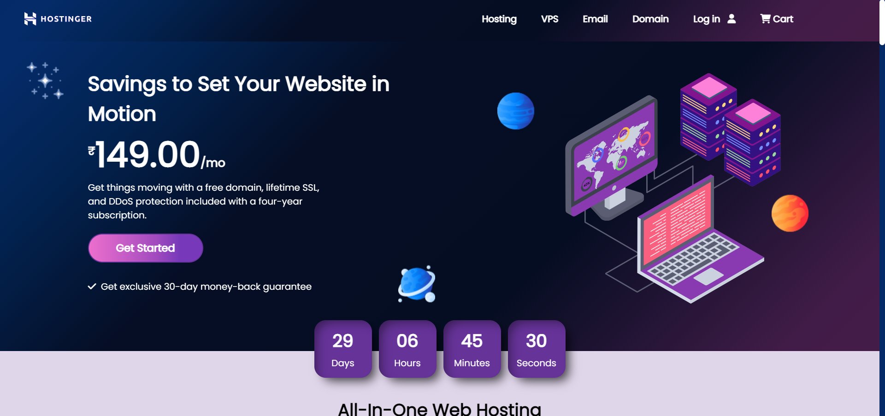

<h1>#ThapaTechnicalCodeFest2<h1>

<h2>Thapa Technical Codefest:</h2> 
It's a monthly event where Host(Vinod Bahadur Thapa) will give a project and you have to submit your project. Codefest will be mostly related to frontend projects and occasionally fullstack project.

<h2>About the Challenge:</h2> 
This codefest is for creating static website with no backend. This time, we have to create a redesigned version of Hostinger website. We  aren't supposed to create clone of it, We have to redesign the whole site. We have to only code the front-end part, no back-end code is needed.

Here are the things that are important/required for the redesigned website:

Redesigned landing page of Hostinger
Responsive navbar and mega menu as an optional tweak
Proper hero section
Pricing section
Testimonial section
Services section
Login/Register page (optionally)

<h3>Final Result</h3>

